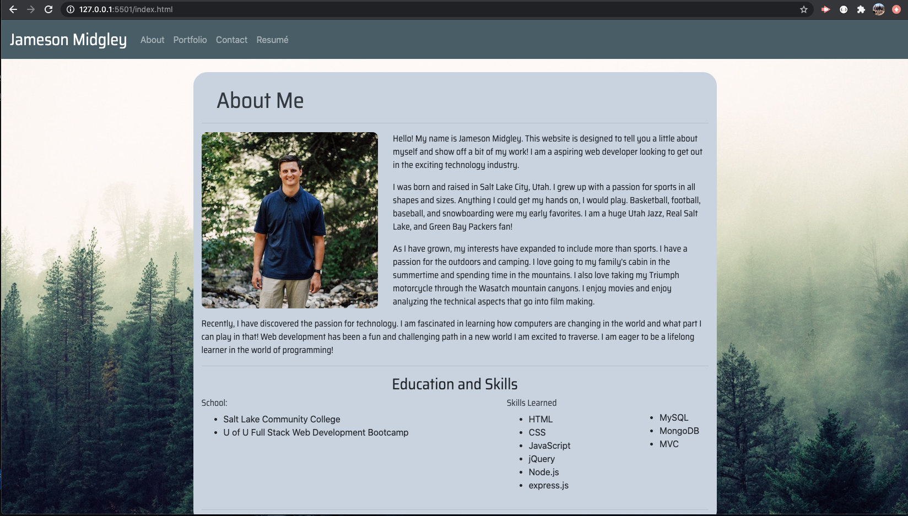
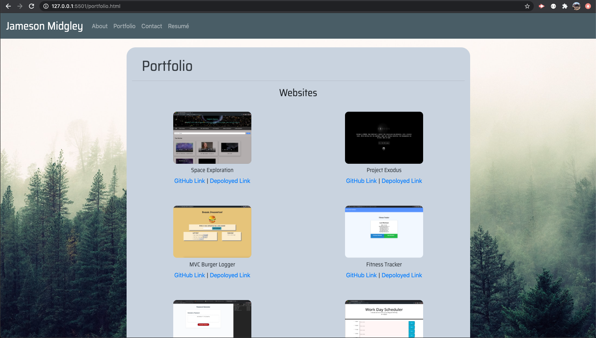
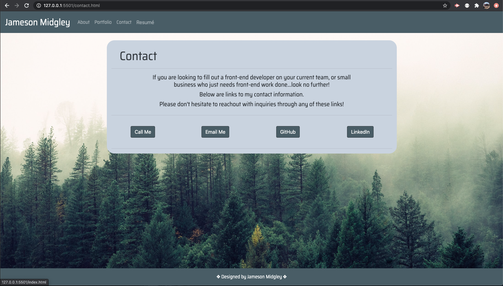

# Portfolio Update  

## Introduction  

This assignment was given to update our portfolio to better reflect our standing in the class up to date.

## Table of Contents:  
* [Objectives](#Objectives)
* [Process](#Process)
* [Challenges](#Challenges)
* [Summary](#Summary)
* [Sites](#Sites)
* [Screenshots](#Screenshots)

## Objectives  

```md
Update the readme to provide a professional portfolio to show to potential employers.
```

## Process  

* I first copied the old portfolio repository into a new repository.  
* I updated the link to the resume. It now opens a new window with options to print.  
* I then began reorganizing the portfolio page.  
* I added more projects to the portfolio page.  
* I then updated some styling for the pictures on portfolio and profile picture.  

## Challenges  

This assignment was not as challenging as past assignments. More of a fill assignment to just make sure we are keeping up being employer-ready. 

## Summary  

This assignment was fun to go back and look at past code to improve upon it. I had things that I can see now that makes sense such as matching styling options that I definitely didn't see before.  

## Sites  

* [Link to repository on GitHub](https://github.com/j-midgley13/updated-portfolio-2)  

* [Link to deployed Website](https://j-midgley13.github.io/updated-portfolio-2/)  

## Screenshots  

  
  
  


